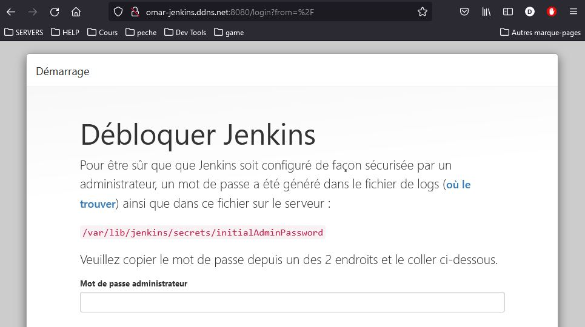
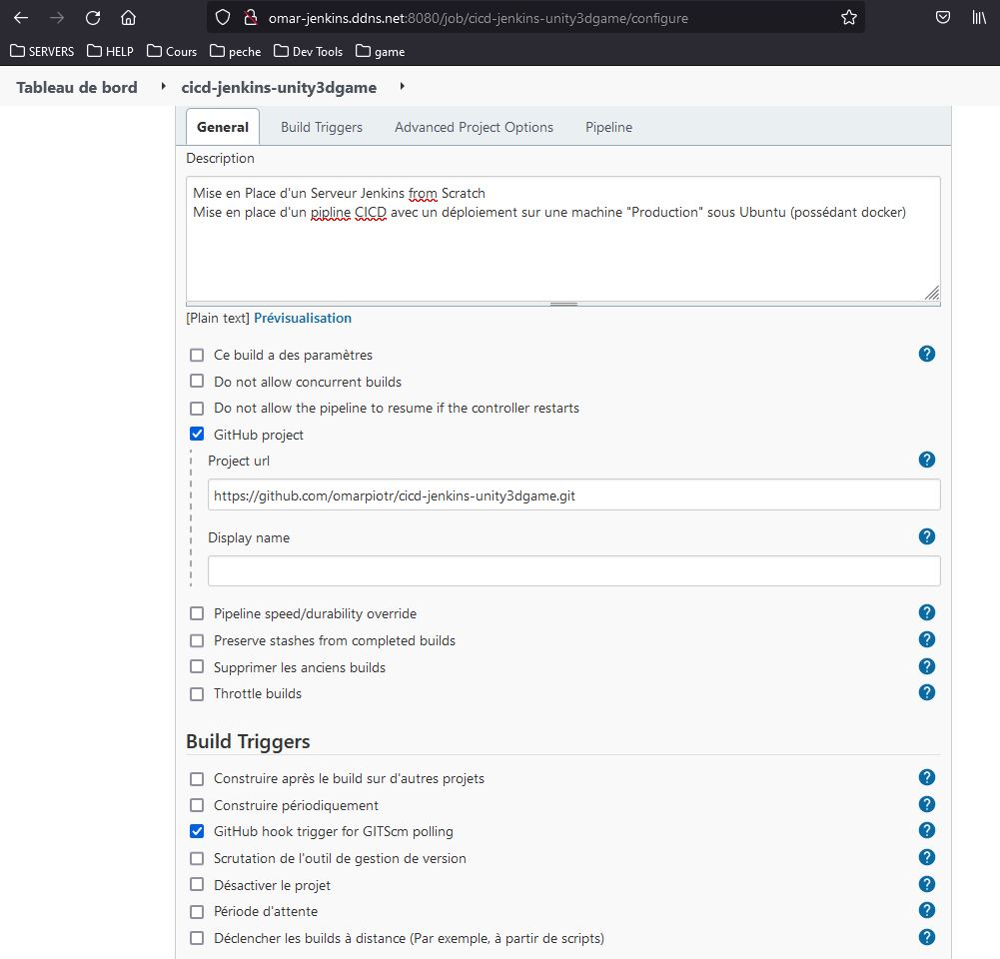
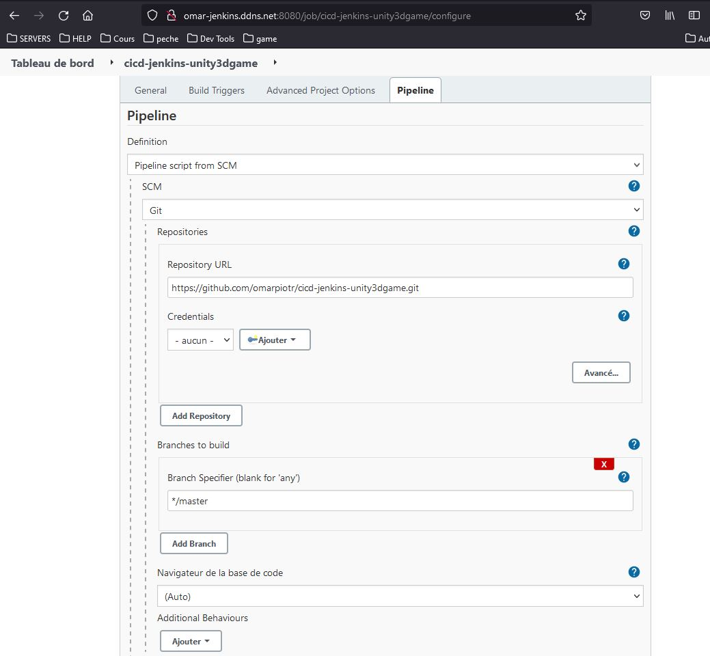
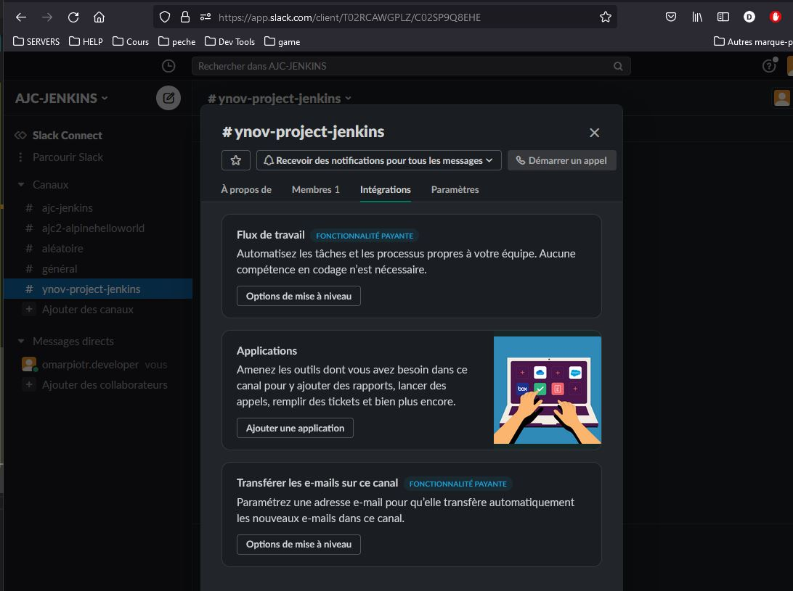
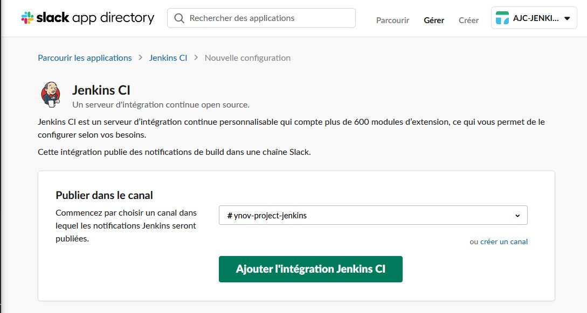
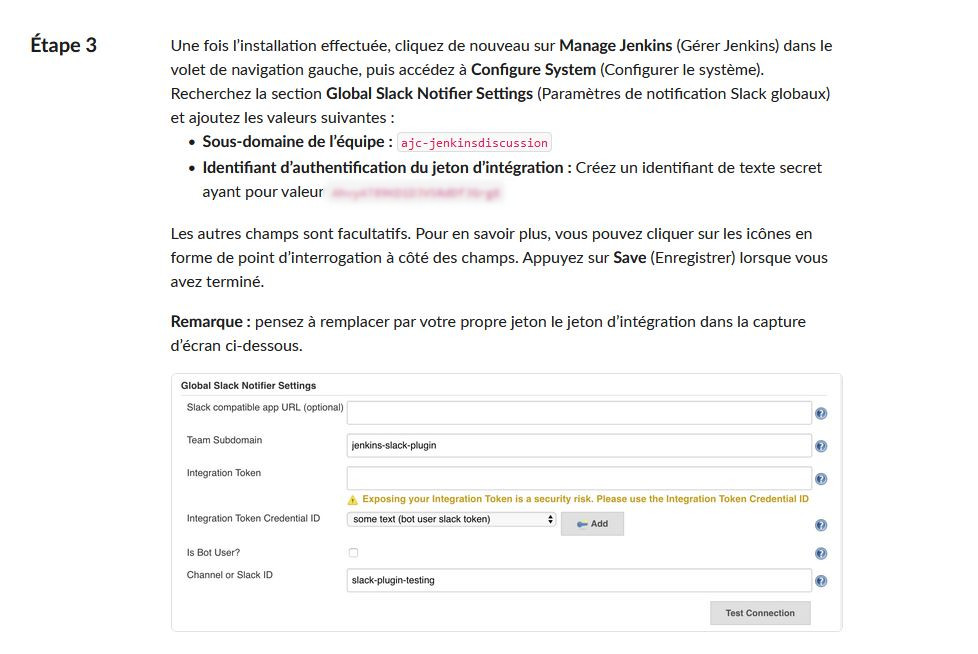

[](http://omar-jenkins.ddns.net:8080/job/cicd-jenkins-unity3dgame/)

# Compte Rendu BENNANI : cicd-jenkins From Scratch 

# 1) Installation et Configuration Serveur Jenkins
## 1.1) Mise en plac de l'environnement de travail
* Utilisation d'un site web Personnel
```bash
echo "# cicd-jenkins-unity3dgame" >> README.md
git init
git add README.md
git commit -m "first commit"
git branch -M master
git remote add origin git@github.com:omarpiotr/cicd-jenkins-unity3dgame.git
git push -u origin master
```
* Création du fichier Dockerfile
```Dockerfile
FROM httpd:2.4
COPY ./ /usr/local/apache2/htdocs/
```
## 1.2) Installation et configuration de nos machines sur AWS
* Ec2 1 : 
    * Name : omar-ec2-Jenkins
    * machine : t2.large
    * ubuntu 20.04 Lts
    * 20 Go
* Ec2 2 : 
    * Name : omar-ec2-Prod
    * machine : t2.micro
    * ubuntu 20.04 Lts
    * Script
    ```bash
    #!/bin/bash
    #Install docker
    curl -fsSL https://get.docker.com -o get-docker.sh
    sh get-docker.sh
    sudo usermod -aG docker ubuntu
    ```
* Sécurity Group :
    * 22 SSH
    * 8080 Interface Jenkins
    * 80 Notre site Web

* Utilisation de no.ip :
    * omar-jenkins.ddns.net : serveur Jenkins
    * omar-production.ddns.net : serveur Production

## 1.3) Installation du serveur Jenkins sur la machine Ubuntu
```bash
# vérification que le pare-feu est désactivé
sudo ufw status

# ajoutez la clé du référentiel au système
wget -q -O - https://pkg.jenkins.io/debian-stable/jenkins.io.key | sudo apt-key add -

# ajoutons l'adresse du référentiel Debian sur la sources.list​​​​​​ du serveur
sudo sh -c 'echo deb http://pkg.jenkins.io/debian-stable binary/ > /etc/apt/sources.list.d/jenkins.list'

# Installation java
sudo apt-get update -y
sudo apt-get install default-jre -y
sudo apt-get install default-jdk -y
sudo apt-get install jenkins -y

# Démarrage de Jenkins
sudo systemctl start jenkins
sudo systemctl enable jenkins
```
## 1.4) Débloquer et Configurer Jenkins
* Aller à la page: http://omar-jenkins.ddns.net:8080



```bash
sudo cat /var/lib/jenkins/secrets/initialAdminPassword
    25a5f31fb7e448469e34033f4c1d69d4
```
* Installer les plugins


* Configurer le 1er utilisateur Administrateur

* Configuration de l'instance
    * http://omar-jenkins.ddns.net:8080/

# 2) Création d'un nouveau Projet Pipline
## 2.1) Creation et configuration d'un Projet sous Jenkins
* Nouveau Projet : cicd-jenkins-unity3dgame de type Pipeline
    * cocher GitHub Projet : https://github.com/omarpiotr/cicd-jenkins-unity3dgame.git
    * cocher GitHub hook trigger for GITScm polling
    * Advanced Project Option :
        * Pipeline script from SCM
        * SCM : Git
            *  URL : https://github.com/omarpiotr/cicd-jenkins-unity3dgame.git

<br>


## 2.2) Ajouter des Crédentials
* Docker Hub :
    * Global
    * Nom : omarpiotrdeveloper
    * MDP : token_dockerhub
    * ID  : dockerhub_password
    
* clé SSH pour Production :
    * SSH Username with private key
    * ID : ec2_prod_private_key
    * Username : ubuntu
    * Private key : celle qu'on utilise pour se connecter sur nos machines AWS

* GitHub:


## 2.3) Installation de Plugin
* GitHub Integration (Build Triggers)
* Embeddable Build Status  (Jenkins → GitHub build-status)
* Slack Notification (Jenkins → Slack notifications)

## 2.4) Configuration des Plugins
* GitHub : Ajouter un webhook : Projet → Settings → Webhooks → add webhook
    * URL : http://omar-jenkins.ddns.net:8080/github-webhook/
    * Onglet Recent Deliveries : vérifier si tout est OK


* Slack : Utiliser le workspace AJC-JENKINS de la dernière fois.
    * Création d'un nouveau canal : ynov-project-jenkins
    * Propriétés =→ Intégration =→ Application =→ Ajouter une application
        * choisir Jenkins =→ configuration
        * Ajouter à Slack
        * Publier dans le canal : ynov-project-jenkins
        * Ajouter
        * Récupérer les données :
            * canal : #ynov-project-jenkins
            * sous-domaine : ajc-jenkinsdiscussion
            * identifiant jeton : ***token_slack*** AhvyAT89KDiDJVSRdDfJGrg8
        * Enregistrer les paramètres

<br>
<br>
<br>

* Configuration de Slack dans Jenkins :
    * [ Jenkins ] → Configurer le système → Slack
        * Créer le Credential **slack_token** de type ***Secret text***
        * Séléctioner le Crédential ainsi crée

<br>
<br>

* Ajouter le GitHub build-status dans le README.md :
    * [ Jenkins ] → cicd-jenkins-unity3dgame → Embeddable Build Status

<br>

* [ GitHub] → README.md → Ajouter la ligne en début de fichier
```
[](http://omar-jenkins.ddns.net:8080/job/cicd-jenkins-unity3dgame/)
```

# Jenkinsfile


